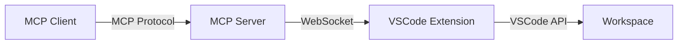

# VSCode MCP Proxy

A VSCode extension that hosts a WebSocket server, enabling MCP (Model Context Protocol) servers to connect and proxy VSCode API calls for refactoring and code manipulation.

## Overview

This project consists of two main components:

1. **VSCode Extension**: Hosts a WebSocket server that exposes VSCode APIs
2. **MCP Server**: Connects to the extension via WebSocket and provides MCP tools for code refactoring



## Features

- 🔌 WebSocket-based communication between MCP server and VSCode
- 🔄 Persistent connection with automatic reconnection
- 🛠️ Refactoring tools exposed via MCP protocol
- 📝 Type-safe protocol definitions
- 🔍 Comprehensive error handling and logging

## Prerequisites

- **Node.js**: v20.x or higher
- **VSCode**: v1.90.0 or higher
- **npm**: v9.x or higher

## Installation

### 1. Clone the Repository

```bash
git clone <repository-url>
cd vscode-mcp
```

### 2. Install Dependencies

Install dependencies for both the extension and MCP server:

```bash
# Install extension dependencies
npm install

# Install MCP server dependencies
cd mcp-server
npm install
cd ..
```

### 3. Build the Project

```bash
npm run build
```

This will compile both the VSCode extension and the MCP server.

## Development

### Project Structure

```
vscode-mcp/
├── src/                      # VSCode extension source
│   ├── extension.ts          # Extension entry point
│   ├── config.ts             # Configuration constants
│   ├── websocket/            # WebSocket server implementation
│   │   ├── server.ts         # WebSocket server class
│   │   ├── handlers.ts       # Message handlers
│   │   └── types.ts          # Type definitions
│   └── utils/
│       └── logger.ts         # Logging utility
├── mcp-server/               # MCP server source
│   ├── src/
│   │   ├── index.ts          # MCP server entry point
│   │   ├── config.ts         # Configuration
│   │   ├── vscode-client.ts  # WebSocket client
│   │   └── tools/            # MCP tools
│   │       └── rename-file.ts
│   └── test/
│       └── integration.test.ts
├── shared/                   # Shared type definitions
│   └── protocol.ts           # WebSocket protocol types
└── out/                      # Compiled output (gitignored)
```

### Build Commands

```bash
# Build everything
npm run build

# Build only the extension
npm run build:extension

# Build only the MCP server
npm run build:mcp

# Clean all build artifacts
npm run clean

# Watch mode for development
npm run watch

# Package the extension
npm run package
```

### Running in Debug Mode

1. Open the project in VSCode
2. Press `F5` to launch the Extension Development Host
3. The WebSocket server will start automatically on port 3000
4. In a separate terminal, start the MCP server:
   ```bash
   cd mcp-server
   npm start
   ```

### Configuration

#### Extension Configuration

Edit [`src/config.ts`](file:///home/enzyme/src/vscode-mcp/src/config.ts) to change:
- WebSocket port (default: 3000)
- Logging verbosity

#### MCP Server Configuration

Edit [`mcp-server/src/config.ts`](file:///home/enzyme/src/vscode-mcp/mcp-server/src/config.ts) to change:
- WebSocket URL
- Reconnection settings
- Request timeout

Or use environment variables:
```bash
export VSCODE_WS_URL=ws://localhost:3000
```

## WebSocket Protocol

### Request Format

Messages sent from the MCP server to the VSCode extension:

```typescript
interface VSCodeRequest {
  id: string;              // Unique request identifier
  command: string;         // Command name (e.g., 'renameFile')
  arguments: Record<string, any>;  // Command-specific arguments
}
```

### Response Format

Messages sent from the VSCode extension to the MCP server:

```typescript
interface VSCodeResponse {
  id: string;              // Matches request ID
  result?: any;            // Success result
  error?: string;          // Error message (if failed)
}
```

### Available Commands

#### `renameFile`

Rename a file in the VSCode workspace.

**Arguments:**
```typescript
{
  oldUri: string;  // Current file URI (e.g., 'file:///path/to/old.txt')
  newUri: string;  // New file URI (e.g., 'file:///path/to/new.txt')
}
```

**Response:**
```typescript
{
  result: boolean  // true if successful
}
```

## Adding New Tools

### 1. Define the Tool in MCP Server

Create a new file in `mcp-server/src/tools/`:

```typescript
// mcp-server/src/tools/my-tool.ts
import { VSCodeCommand } from '../../shared/protocol.js';
import { getVSCodeClient } from '../vscode-client.js';

export async function myTool(arg1: string, arg2: number): Promise<any> {
  const client = getVSCodeClient();
  return await client.sendRequest('myCommand', { arg1, arg2 });
}
```

### 2. Add Command Handler in Extension

Update `src/websocket/handlers.ts`:

```typescript
case 'myCommand':
  await handleMyCommand(ws, data);
  break;
```

Add the handler function:

```typescript
async function handleMyCommand(ws: WebSocket, request: VSCodeRequest): Promise<void> {
  // Implement your VSCode API call here
  const result = await vscode.commands.executeCommand('...');
  sendResponse(ws, request.id, result);
}
```

### 3. Register in MCP Server

Update `mcp-server/src/index.ts` to expose the tool via MCP protocol.

## Testing

### Integration Test

Run the integration test to verify WebSocket communication:

```bash
cd mcp-server
npm test
```

The test creates a mock VSCode WebSocket server and verifies the MCP server can communicate with it.

## Troubleshooting

### MCP Server Can't Connect

**Error:** `Failed to connect to VSCode extension`

**Solution:**
1. Ensure the VSCode extension is running (press `F5` in VSCode)
2. Check that the WebSocket port (default 3000) is not in use
3. Verify the WebSocket URL in `mcp-server/src/config.ts` matches the extension port

### Build Errors

**Error:** `File 'shared/protocol.ts' is not under 'rootDir'`

**Solution:** This should be resolved by the updated `tsconfig.json` files. If you still see this error, run:
```bash
npm run clean
npm run build
```

### TypeScript Module Resolution Issues

**Error:** `Cannot find module '../../shared/protocol.js'`

**Solution:** Ensure you're using the `.js` extension in imports (required for ES modules) and that both `tsconfig.json` files include the `shared/` directory.

## Contributing

1. Follow the existing code structure and naming conventions
2. Add JSDoc comments for public APIs
3. Update this README if adding new features
4. Test your changes with the integration test

## License

[Add your license here]

## Architecture Notes

### Why WebSocket?

- **Bidirectional Communication**: Allows both request/response and push notifications
- **Persistent Connection**: Reduces overhead compared to HTTP polling
- **Real-time**: Low latency for interactive refactoring operations

### Why Separate MCP Server?

- **Modularity**: MCP server can run independently of VSCode
- **Flexibility**: Can be used with different MCP clients
- **Isolation**: Separates concerns between VSCode integration and MCP protocol

### Connection Management

The MCP server maintains a persistent WebSocket connection with automatic reconnection:
- **Reconnection Attempts**: 5 attempts with 1-second delay
- **Request Timeout**: 5 seconds per request
- **Request Correlation**: Unique IDs for matching requests with responses
