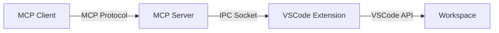

# VSCode MCP Proxy Extension

A VSCode extension that hosts an IPC server, enabling MCP (Model Context Protocol) servers to connect and proxy VSCode API calls for refactoring and code manipulation.

## Overview

This project consists of two main components:

1. **VSCode Extension**: Hosts an IPC server that exposes VSCode APIs via Unix Domain Sockets (Linux/macOS) or Named Pipes (Windows)
2. **MCP Server**: Connects to the extension via IPC and provides MCP tools for code refactoring



## Features

- 🔌 IPC-based communication using Unix Domain Sockets/Named Pipes
- 🔄 Automatic connection establishment via environment variables
- 🛠️ Refactoring tools exposed via MCP protocol
- 📝 Type-safe protocol definitions
- 🔍 Comprehensive error handling and logging
- 🌐 Multi-workspace support with isolated IPC connections

## Prerequisites

- **Node.js**: v20.x or higher
- **VSCode**: v1.90.0 or higher
- **npm**: v9.x or higher

## Installation

### 1. Clone the Repository

```bash
git clone <repository-url>
cd vscode-mcp
```

### 2. Install Dependencies

```bash
npm install
```

### 3. Build the Project

```bash
npm run build
```

This will compile both the VSCode extension and the MCP server.

## Development

### Project Structure

```
vscode-mcp/
├── packages/
│   ├── extension/           # VSCode extension
│   │   ├── src/
│   │   │   ├── extension.ts     # Extension entry point
│   │   │   ├── config.ts        # Configuration constants
│   │   │   ├── ipc/             # IPC server implementation
│   │   │   │   └── server.ts    # IPC server class
│   │   │   └── utils/
│   │   │       └── logger.ts    # Logging utility
│   ├── server/              # MCP server
│   │   ├── src/
│   │   │   ├── index.ts         # MCP server entry point
│   │   │   ├── config.ts        # Configuration
│   │   │   ├── vscode-client.ts # IPC client
│   │   │   └── tools/           # MCP tools
│   │   │       └── rename-file.ts
│   │   └── test/
│   │       └── integration.test.ts
│   └── shared/              # Shared type definitions
│       └── src/
│           ├── protocol.ts      # IPC protocol types
│           └── config.ts        # Shared configuration
└── out/                     # Compiled output (gitignored)
```

### Build Commands

```bash
# Build everything
npm run build

# Clean all build artifacts
npm run clean

# Watch mode for development
npm run watch

# Package the extension
npm run package
```

### Running in Debug Mode

1. Open the project in VSCode
2. Press `F5` to launch the Extension Development Host
3. The IPC server will start automatically and output the socket path
4. The MCP server will connect automatically via environment variable

### How It Works

1. **Extension Startup**: When activated, the extension starts an IPC server with a unique socket path
2. **Socket Path Communication**: The socket path is passed to the MCP server via the `VSCODE_MCP_SOCKET_PATH` environment variable
3. **MCP Server Connection**: The MCP server connects to the IPC server using the provided socket path
4. **API Proxying**: Requests from the MCP server are processed by the extension and VSCode API calls are executed

### Configuration

The IPC server automatically generates a unique socket path for each VSCode workspace instance:
- **Linux/macOS**: `/tmp/vscode-mcp-{random}.sock`
- **Windows**: `\\\\.\\pipe\\vscode-mcp-{random}`

## IPC Protocol

### Request Format

Messages sent from the MCP server to the VSCode extension:

```typescript
interface VSCodeRequest {
  id: string;              // Unique request identifier
  command: string;         // Command name (e.g., 'renameFile')
  arguments: Record<string, any>;  // Command-specific arguments
}
```

### Response Format

Messages sent from the VSCode extension to the MCP server:

```typescript
interface VSCodeResponse {
  id: string;              // Matches request ID
  result?: any;            // Success result
  error?: string;          // Error message (if failed)
}
```

### Available Commands

#### `renameFile`

Rename a file in the VSCode workspace.

**Arguments:**
```typescript
{
  oldUri: string;  // Current file URI (e.g., 'file:///path/to/old.txt')
  newUri: string;  // New file URI (e.g., 'file:///path/to/new.txt')
}
```

**Response:**
```typescript
{
  result: { success: boolean }  // true if successful
}
```

## Adding New Commands

### 1. Add Command Handler in Extension

Update `packages/extension/src/ipc/server.ts` in the `processMessage` method:

```typescript
case VSCodeCommand.MY_COMMAND:
    const { arg1, arg2 } = request.arguments;
    // Implement your VSCode API call here
    const result = await vscode.commands.executeCommand('...');
    response.result = result;
    break;
```

### 2. Define the Command Constant

Update `packages/shared/src/protocol.ts`:

```typescript
export enum VSCodeCommand {
    RENAME_FILE = 'renameFile',
    MY_COMMAND = 'myCommand',
}
```

### 3. Create Tool in MCP Server

Create a new file in `packages/server/src/tools/`:

```typescript
import { VSCodeCommand } from '@vscode-mcp/shared';
import { getVSCodeClient } from '../vscode-client.js';

export async function myTool(arg1: string, arg2: number): Promise<any> {
  const client = getVSCodeClient();
  return await client.sendRequest(VSCodeCommand.MY_COMMAND, { arg1, arg2 });
}
```

### 4. Register in MCP Server

Update `packages/server/src/index.ts` to expose the tool via MCP protocol.

## Testing

### Integration Test

Run the integration test to verify IPC communication:

```bash
npm test -w packages/server
```

## Troubleshooting

### MCP Server Can't Connect

**Error:** `Failed to connect to VSCode extension`

**Solution:**
1. Ensure the VSCode extension is running (press `F5` in VSCode)
2. Check the VSCode output channel "VSCode MCP Proxy" for the socket path
3. Verify the VSCODE_MCP_SOCKET_PATH environment variable is set correctly

### Build Errors

**Solution:** Clean and rebuild:
```bash
npm run clean
npm run build
```

## Architecture Notes

### Why IPC (Unix Domain Sockets/Named Pipes)?

- **No Port Conflicts**: Unlike WebSocket servers, each workspace gets a unique socket path
- **Better Security**: IPC connections are restricted to the local machine and can leverage file system permissions
- **Multi-Workspace Support**: Multiple VSCode instances can run simultaneously without conflicts
- **Lower Overhead**: No TCP/IP stack overhead for local communication
- **Platform Native**: Uses the OS-native IPC mechanism (UDS on Unix, Named Pipes on Windows)

### Why Separate MCP Server?

- **Modularity**: MCP server can run independently as a separate process
- **Flexibility**: Can be used with different MCP clients (Claude Desktop, etc.)
- **Isolation**: Separates concerns between VSCode integration and MCP protocol

### Connection Management

The MCP server connects to the VSCode extension via IPC:
- **Automatic Socket Discovery**: Socket path passed via environment variable
- **Line-delimited JSON**: Messages are sent as JSON strings separated by newlines
- **Request Correlation**: Unique IDs for matching requests with responses
